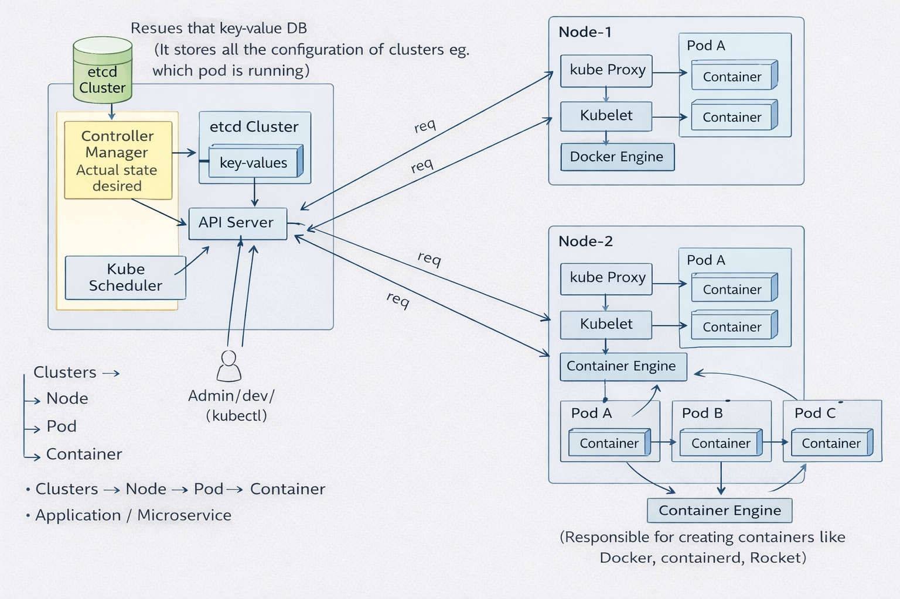

# 🚀 Kubernetes Architecture — Explained

This repository contains a simple and clear explanation of Kubernetes Architecture, covering all core components and how they work together in a cluster.

---

## 🧠 What is Kubernetes?

Kubernetes is a container orchestration platform that automates deployment, scaling, and management of containerized applications.

---

## 🏗️ Architecture Overview

Kubernetes architecture is divided into two main parts:

- **Control Plane (Brain)** → Manages the cluster  
- **Worker Nodes (Execution Layer)** → Runs applications  

---

## 🔹 Control Plane (The Brain)

Responsible for managing the cluster and making decisions:

- **API Server** → Central entry point, all requests pass through it  
- **etcd** → Stores complete cluster state (pods, configs, data)  
- **Scheduler** → Decides which node a new pod should run on  
- **Controller Manager** → Maintains desired state (creates/replaces pods if needed)  

---

## 🔹 Worker Nodes (The Execution Layer)

Responsible for running actual applications:

- **Kubelet** → Node agent that runs and monitors containers  
- **Kube-proxy** → Handles networking and routes traffic to correct pods  
- **Container Runtime** → Runs containers (e.g., Docker, containerd)  
- **Pods** → Smallest unit where application containers run  

---

## 🔄 How It Works (Flow)

1. User sends request using `kubectl`  
2. Request goes to **API Server**  
3. **Scheduler** assigns a node  
4. **Controller Manager** ensures desired state  
5. **Kubelet** runs the pod on the node  
6. **Container Runtime** starts the container  
7. **Kube-proxy** manages traffic  

---

## 💡 Key Insight

> Kubernetes doesn’t guarantee reliability by default — it provides the tools.  
> Stability depends on proper configuration of scaling, health checks, and resource limits.

---

## 🎯 Why This Matters

Understanding Kubernetes architecture helps in:
- Debugging production issues  
- Designing scalable systems  
- Handling traffic spikes  
- Preventing system failures  

---

## 📌 Conclusion

Kubernetes separates decision-making from execution:
- Control Plane → Decides what should run  
- Worker Nodes → Actually run the applications  

---

## 🏷️ Tags

`Kubernetes` `DevOps` `Containers` `Docker` `Backend` `Cloud`

---
